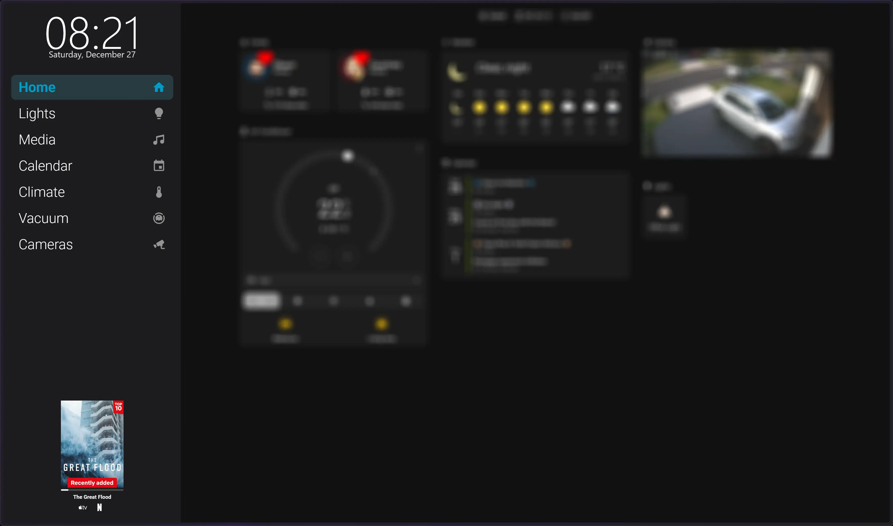

# Now Playing Sidebar Card (Home Assistant)

A **compact, theme-independent “Now Playing” card** designed specifically for use inside the  
[`sidebar-card`](https://github.com/DBuit/sidebar-card) **bottomCard** area in Home Assistant.

This card is implemented as a **single custom Lovelace card** (no `conditional`, no `vertical-stack`) so it works reliably inside the sidebar without layout bugs. It is intended **exclusively** for `sidebar-card` **bottomCard** integration.



## ✨ Features

- ✅ **Single-card implementation**  
  Works inside `sidebar-card` where conditional / stack cards break.

- 🎵 **Now Playing display**
  - Artwork
  - Track title + artist
  - Playback progress bar

- ⏯️ **Playback controls**
  - Previous / Play–Pause / Next

- 🚫 **Smart hiding**
  - Card renders nothing when the media player is:
    - `idle`
    - `off`
    - `unavailable`

---

## 📦 Installation

HACS Installation
Go to the hacs store and use the repo url https://github.com/2wenty2wo/now-playing-sidebar-card and add this as a custom repository under settings.

In Home Assistant's global settings, add the resource:

Go to Settings → Dashboards → Three-dots menu → Resources in the top right
Click + Add Resource button in the bottom right
Enter in the following:
URL: /hacsfiles/now-playing-sidebar-card/now-playing-sidebar-card.js
Resource Type: Dashboard 
Click Create


---

## ⚙️ Configuration Options

Options below apply to the `sidebar-card` `bottomCard` config.

| Option | Default | Description |
|------|--------|------------|
| `entity` | **required** | Media player entity |
| `width` | `165` | Total card column width |
| `art_width` | `165` | Artwork width |
| `art_height` | `165` | Artwork height |
| `hide_youtube_cast_art` | `true` | Hides fake Cast artwork for YouTube |
| `hide_when_no_art` | `false` | Hides the card when artwork is missing or suppressed |
| `marquee_title` | `false` | Scrolls long titles horizontally when they overflow |
| `show_progress` | `true` | Shows playback progress bar and live updates |
| `show_controls` | `true` | Shows playback controls (previous/play/pause/next) |

Example (sidebar `bottomCard`):

```yaml
sidebar:
  bottomCard:
    type: custom:now-playing-sidebar-card
    cardStyle: |
      :host {
        width: 100%;
        max-width: 100%;
        box-sizing: border-box;
        overflow: hidden;
      }
    cardOptions:
      entity: media_player.preferred_now_playing
      width: 150
      height: 215
      radius: 14
      hide_youtube_cast_art: true
      marquee_title: true
      show_progress: true
      show_controls: false
      hide_when_no_art: true
```

---

## 🎯 Why This Exists

The `sidebar-card` **cannot safely render**:

- `conditional`
- `vertical-stack`
- `horizontal-stack`

Attempting to do so causes:
- Layout corruption
- Invisible cards
- Broken updates

This card solves that by:

- Rendering **everything inside one custom element**
- Handling state logic internally
- Rendering **nothing** when inactive

---

## 🧩 Known Limitations

- Icon packs like `si:` and `phu:` must be installed if used
- Designed for sidebars, not full-width dashboards

---

## 📄 License

MIT — do whatever you want with it.  
If you improve it, future you will appreciate a commit message.
